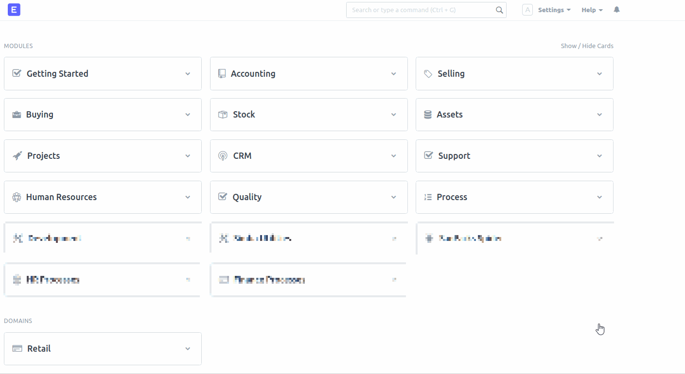

## Deprecation Notice

This app is deprecated as this functionality is now available in ERPNext Version 13

See [this PR](https://github.com/frappe/erpnext/pull/22901) for more details


---


## ERPNext Customer Statements Sender

This app allows you to send out statements to your customers in bulk

#### 🛠 Please note that this is a Work in Progress 🛠 Issues and PR's welcome. This app was designed for Frappe/ERPNext v12.

The interface is on a Single Doctype called `Customer Statements Sender`:



### Install

```bash
cd frappe-bench
bench get-app https://github.com/dvdl16/erpnext_customer_statements_sender.git
bench --site site1.local install-app erpnext_customer_statements_sender
```

(Replace `site1.local` with your site name.)


#### License

Copyright (C) 2020  Dirk van der Laarse

MIT

#### 🛠 Please note that this is a Work in Progress 🛠 Make sure you check the statements beforehand to avoid angry customers. This app was designed for Frappe/ERPNext v12.
